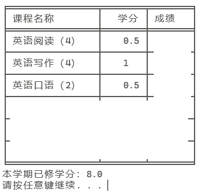
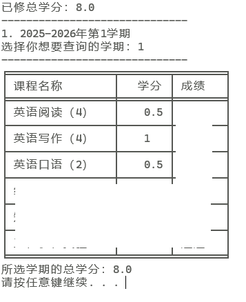

# BUAA_Score_Query
北航研究生成绩查询  
目前还在进一步完善中    
已实现的基本功能：  
- [x] 成绩查询、学分统计
- [x] 绕过评教
- [x] 按照学期选择成绩查看
- [ ] ...... 

## 使用方法  
写在前面：  
本项目基于Python，测试于Python3.13  
1. `cjcx.py`只查询本学期成绩（也就是2025-2026学年第一学期/2025秋学期）的成绩
2. `cjcx_choose.py`可以选择查询某一学年的成绩
3. 二者需要一起下载下来，因为`cjcx_choose.py`的实现依赖于`cjcx.py`.

### 具体使用方法
1. 安装依赖
   ```
   pip install beautifulsoup4 tabulate requests wcwidth
   ```
3. 在`cjcx.py`中填写账号密码：
   ```python
   authen = {
    'username': '',#填写学号
    'password': '',#填写密码
    }
   ```
4. 运行相应的Python文件即可
   ```
   %path to python%\python.exe %path to file%/cjcx.py
   ```

## 效果示例
1. `cjcx.py`：只查询2025-2026第一学期的成绩  
  
1. `cjcx_choose.py`：选择查看  


## 原理
由于`gsmis`中没有评教时候会直接显示未评教。估计是逻辑是后端屏蔽，因此本地无法获取。  
注意到在用智慧校园时，偶尔会无视未评教，直接弹出成绩。考虑模拟vx登录，观察到HTML中已经收到了后端发来的成绩，只是未显示，因此可以考虑直接获取到成绩。
